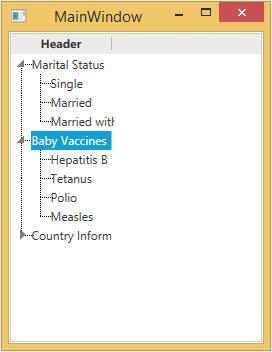
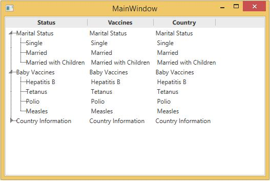

# Create multiple column in WPF TreeView

This session describes about creating multiple column in [WPF TreeView](https://help.syncfusion.com/wpf/classic/treeview/overview) (TreeViewAdv).

`TreeView` control can be created with multiple columns by setting the `MultiColumnEnable` property to `true`. This is dependency property, which gets or sets the value defining whether items are in multicolumn mode. The default value is `false`.

#### XAML

``` xml
<!-- Adding TreeViewAdv with Enabling multiple column -->
<syncfusion:TreeViewAdv  Name="treeViewAdv" MultiColumnEnable="True">
    <!-- Adding TreeViewItemAdv -->
    <syncfusion:TreeViewItemAdv Name="treeViewItemAdv" Header="Marital Status">
        <syncfusion:TreeViewItemAdv Header="Single"/>
        <syncfusion:TreeViewItemAdv Header="Married"/>
        <syncfusion:TreeViewItemAdv Header="Married with Children"/>
    </syncfusion:TreeViewItemAdv>
    <syncfusion:TreeViewItemAdv Header="Baby Vaccines">
        <syncfusion:TreeViewItemAdv Header="Hepatitis B"/>
        <syncfusion:TreeViewItemAdv Header="Tetanus"/>
        <syncfusion:TreeViewItemAdv Header="Polio"/>
        <syncfusion:TreeViewItemAdv Header="Measles"/>
    </syncfusion:TreeViewItemAdv>
    <syncfusion:TreeViewItemAdv Header="Country Information">
        <syncfusion:TreeViewItemAdv Header="Canada"/>
        <syncfusion:TreeViewItemAdv Header="France"/>
        <syncfusion:TreeViewItemAdv Header="Germany"/>
        <syncfusion:TreeViewItemAdv Header="UK"/>
        <syncfusion:TreeViewItemAdv Header="USA"/>
    </syncfusion:TreeViewItemAdv>
</syncfusion:TreeViewAdv>
```
#### C#

``` csharp
//Enable multiple column enable
treeViewAdv.MultiColumnEnable = true;
```

#### VB

``` vb
'Enable multiple column enable
treeViewAdv.MultiColumnEnable = True
```



### Header for MultiColumn

TreeViewAdv allow user to set headers for individual columns using the Columns property. All the columns are defined in TreeViewColumnCollections.

``` xml
<!-- Adding TreeViewAdv with Enabling multiple column -->
<syncfusion:TreeViewAdv Name="treeViewAdv" MultiColumnEnable="True">
    <!-- Adding TreeViewItemAdv -->
    <syncfusion:TreeViewItemAdv Name="treeViewItemAdv" Header="Marital Status">
        <syncfusion:TreeViewItemAdv Header="Single"/>
        <syncfusion:TreeViewItemAdv Header="Married"/>
        <syncfusion:TreeViewItemAdv Header="Married with Children"/>
    </syncfusion:TreeViewItemAdv>
    <syncfusion:TreeViewItemAdv Header="Baby Vaccines">
        <syncfusion:TreeViewItemAdv Header="Hepatitis B"/>
        <syncfusion:TreeViewItemAdv Header="Tetanus"/>
        <syncfusion:TreeViewItemAdv Header="Polio"/>
        <syncfusion:TreeViewItemAdv Header="Measles"/>
    </syncfusion:TreeViewItemAdv>
    <syncfusion:TreeViewItemAdv Header="Country Information">
        <syncfusion:TreeViewItemAdv Header="Canada"/>
        <syncfusion:TreeViewItemAdv Header="France"/>
        <syncfusion:TreeViewItemAdv Header="Germany"/>
        <syncfusion:TreeViewItemAdv Header="UK"/>
        <syncfusion:TreeViewItemAdv Header="USA"/>
    </syncfusion:TreeViewItemAdv>
    <!-- Adding header -->
    <syncfusion:TreeViewAdv.Columns>
        <syncfusion:TreeViewColumnCollection>
            <syncfusion:TreeViewColumn Width="150" Header="Status"
            DisplayMemberBinding="{Binding Path=Header, RelativeSource={RelativeSource AncestorType={x:Type syncfusion:TreeViewItemAdv}}}"/>
            <syncfusion:TreeViewColumn Width="100" Header="Vaccines"
            DisplayMemberBinding="{Binding Path=Header, RelativeSource={RelativeSource AncestorType={x:Type syncfusion:TreeViewItemAdv}}}"/>
            <syncfusion:TreeViewColumn Width="50" Header="Country"
            DisplayMemberBinding="{Binding Path=Header, RelativeSource={RelativeSource AncestorType={x:Type syncfusion:TreeViewItemAdv}}}"/>
        </syncfusion:TreeViewColumnCollection>
    </syncfusion:TreeViewAdv.Columns>
</syncfusion:TreeViewAdv>
```

